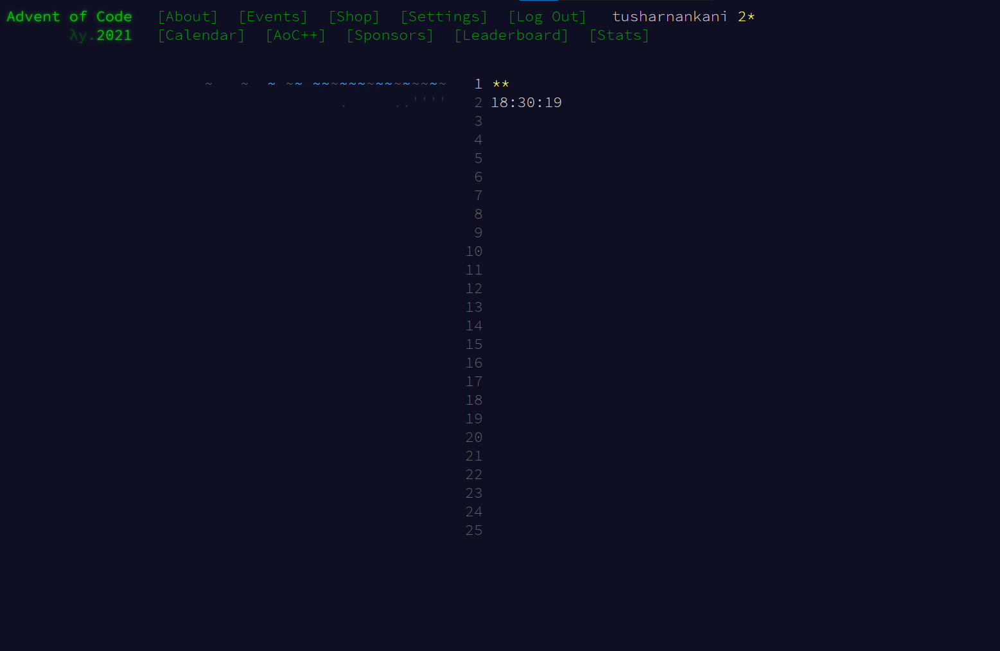

## AdventOfCode

<br>

My attempt at Advent of Code 2021


<!-- <p align="center"> -->

<!-- </p> -->

<br>

#### What is Advent of Code?

Advent of Code is an Advent calendar of small programming puzzles for a variety of skill sets and skill levels that can be solved in [any](https://github.com/search?q=advent+of+code) programming language you like. People use them as a [speed contest](https://adventofcode.com/leaderboard), [interview](https://y3l2n.com/2018/05/09/interview-prep-advent-of-code/) [prep](https://twitter.com/dznqbit/status/1037607793144938497), [company training](https://twitter.com/pgoultiaev/status/950805811583963137), [university](https://gitlab.com/imhoffman/fa19b4-mat3006/wikis/home) [coursework](https://www.gribblelab.org/scicomp2019/), [practice](https://twitter.com/mrdanielklein/status/936267621468483584) [problems](https://comp215.blogs.rice.edu/), or to [challenge each other](https://www.reddit.com/r/adventofcode/search?q=flair%3Aupping&restrict_sr=on).

~ via [About - Advent of Code 2021](https://adventofcode.com/2021/about)

<br>

### Side Learnings

<br>

Wrote a bash script to create the folder structure like this.

<br>

```
day
|__part1.cpp
|__part2.cpp
```

<br>

Find the [bash script](/go.bash) here.

<br>

```bash
for num in {1..25}
do
if [ $num -lt 10 ]
then
    mkdir 0$num
    cd 0$num
        > 1.cpp
        > 2.cpp
else
    mkdir $num
    cd $num
        > 1.cpp
        > 2.cpp
fi
cd ..
done
```

<br>

or simply 🤭

```bash
for num in {1..25}; do if [ $num -lt 10 ]; then mkdir 0$num; cd 0$num; > 1.cpp; > 2.cpp; else mkdir $num; cd $num; > 1.cpp; > 2.cpp; fi; cd ..; done
```
<br>

### Author

[Tushar Nankani](https://tusharnankani.github.io/about/)
